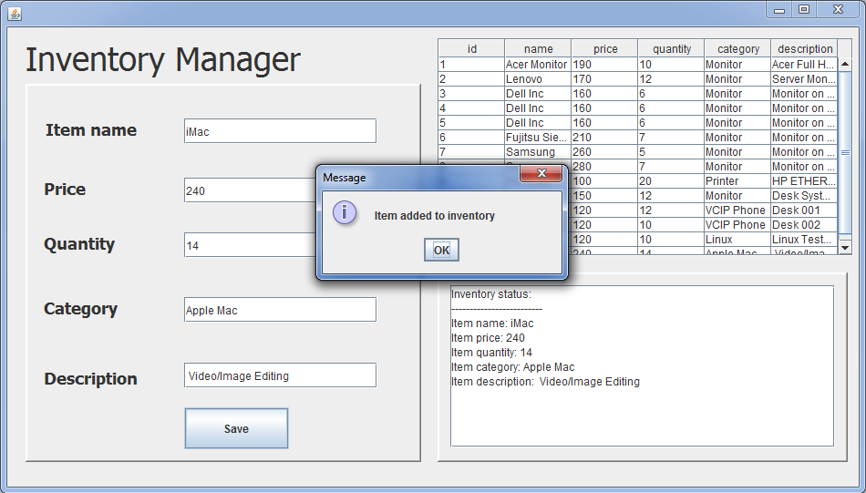

<h1>Inventory Manager</h1> 

<h2>Description:</h2>

Inventory Manager takes inputs from the user and sends them to MySQL database. On right side there are two displays that show all items in database and what was last added.

<h2>Prerequisites</h2>

NetBeans IDE and Xampp

